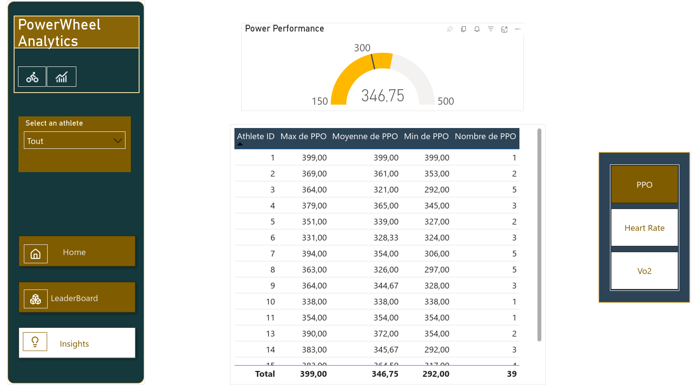

# Cycling APP

Une API REST développée avec FastAPI pour la gestion des athlètes cyclistes et de leurs performances. Cette application permet aux coachs de suivre leurs athlètes, d'enregistrer leurs performances et d'analyser leurs statistiques.

### Dépendances principales


## Fonctionnalités Principales

- Authentification JWT
- Gestion des utilisateurs (athlètes, coachs, admin)
- Suivi des performances des athlètes
- Statistiques des performances
- Interface utilisateur Streamlit
- Système de rôles (admin/coach/athlete)

## Prérequis

- Python 3.11+
- SQLite3

## Installation

1. Cloner le repository
2. Créer un environnement virtuel :
```bash
python -m venv .venv
source .venv/bin/activate # Linux/Mac
.venv\Scripts\activate # Windows
```
3. Installer les dépendances :
```bash
pip install -r requirements.txt
```
4. Configurer les variables d'environnement dans .env
```
ACCESS_TOKEN_EXPIRE_MINUTES = 30
SECRET_KEY = "votre_clé_secrète"
ALGORITHM = "HS256"
API_URL = "http://localhost:8000/"
```


## Structure de la Base de Données

### MCD (Modèle Conceptuel de Données)

.

### MLD (Modèle Logique de Données)

.

### MPD (Modèle Physique de Données)

.

## Structure du Projet

```
 ├── endpoints/ # Routes API
│ ├── athletes.py # Gestion des athlètes
│ ├── performances.py # Gestion des performances
│ ├── stats.py # Statistiques
│ └── users.py # Gestion des utilisateurs
├── streamlit_app/ # Interface utilisateur
│ ├── main_app.py # Point d'entrée Streamlit
│ └── pages/ # Pages de l'application
├── database.py # Configuration DB
├── main.py # Point d'entrée API
├── schemas.py # Schémas Pydantic
└── utils.py # Utilitaires
```


## Points d'API Principaux

### Authentification

- POST /user/auth : Connexion et obtention du token JWT
- POST /user/create_athlete : Création d'un compte athlète
- POST /user/create_coach : Création d'un compte coach

### Athlètes

- POST /athletes/create : Création d'un profil athlète
- GET /athletes/athletes : Liste des athlètes
- PUT /athletes/update/{athlete_id} : Mise à jour d'un athlète
- DELETE /athletes/delete/{athlete_id} : Suppression d'un athlète

### Performances

- POST /performances/create : Enregistrement d'une performance
- GET /performances/performances : Liste des performances
- PUT /performances/update/{performance_id} : Mise à jour d'une performance
- DELETE /performances/delete/{performance_id} : Suppression d'une performance

### Statistiques

- GET /stats/vo2max : Meilleur VO2max
- GET /stats/ppo : Meilleure puissance maximale
- GET /stats/weightpower : Meilleur rapport poids/puissance

## Analyse des Données avec Power BI

L'analyse des performances des athlètes a été approfondie grâce à Power BI, permettant une visualisation interactive des données exportées depuis notre base SQLite. Le rapport comprend :

### Rapport des performances globales 

Ce rapport présente une vue d'ensemble des performances des athlètes. L'écran affiche des statistiques clés :


Un graphique à barres compare les moyennes de VO2 Max, PPO et FC Max pour chaque athlète. Le rapport permet également de sélectionner un athlète spécifique pour voir son profil individuel. L'interface offre des options pour naviguer entre la vue d'ensemble, un tableau de classement et des analyses approfondies.


### Profil individuel d'un athlète 

Cette vue détaillée présente les statistiques personnelles d'un athlète, incluant ses informations démographiques, son classement PPO, sa fréquence cardiaque moyenne et l'historique complet de ses performances sportives.


description

### Résumé des meilleures performances moyennes 

Ce tableau de bord présente les meilleures performances moyennes des athlètes. Il affiche un podium visuel avec les trois premiers athlètes, ainsi que des tableaux détaillant les meilleurs scores PPO et ratios PPO/Poids.


### Rapport des performances par athlète

Le tableau présente les performances de puissance (PPO) pour chaque athlète, incluant les valeurs maximales, moyennes et minimales, ainsi que le nombre de mesures effectuées. Il offre une vue détaillée des performances individuelles.

On peut naviguer sur le menu de droite, pour voir les mêmes détails pour la fréquence cardiaque et la consommation d'oxygène.



Ces visualisations permettent aux coachs et athlètes d'identifier rapidement les points forts et axes d'amélioration, facilitant ainsi la prise de décision dans le processus d'entraînement.

## Démarrage des applications 

### API FastAPI

```bash
uvicorn main:app --reload
```


L'API sera accessible sur http://localhost:8000

### Interface Streamlit

```bash
cd streamlit_app
streamlit run main_app.py
```


L'interface sera accessible sur http://localhost:8501

## Documentation API

- Documentation Swagger UI : http://localhost:8000/docs
- Documentation ReDoc : http://localhost:8000/redoc

## Sécurité

- Authentification via JWT
- Mots de passe hashés avec bcrypt
- Système de rôles (admin/coach/athlete)
- Durée de validité configurable des tokens

## Contribution

Les contributions sont les bienvenues ! Pour contribuer :

1. Forkez le projet
2. Créez une branche pour votre fonctionnalité
3. Committez vos changements
4. Poussez vers la branche
5. Ouvrez une Pull Request

## Licence

MIT License - Voir le fichier LICENSE pour plus de détails.

Ce README.md fournit une documentation complète de votre projet, incluant les dépendances, prérequis, structure du projet, points d'API, instructions d'installation et de démarrage, sécurité, et procédures de contribution. Les emplacements pour insérer les images du MCD, MLD et MPD sont inclus, et la partie de création de la base de données a été omise comme demandé.


## Contact


<p align="left">
  
</p>


<div>
<h4>Eliandy RYMER </h4>
<a href = "mailto: rymer.eliandy@gmail.com"></a>
<a href="https://www.linkedin.com/in/eliandy-r-4a0592a8/" target="_blank">
  
</a>  
<a href="https://github.com/EliandyDumortier" target="_blank">
  
</a>
</div>

<div>
<h4>Malek BOUMEDINE </h4>
<a href = "mailto: malek.boumedine@gmail.com"></a>
<a href="https://www.linkedin.com/in/malek-boumedine" target="_blank">
  
</a>  
<a href="https://github.com/Malek-Boumedine" target="_blank">
  
</a>
</div>
